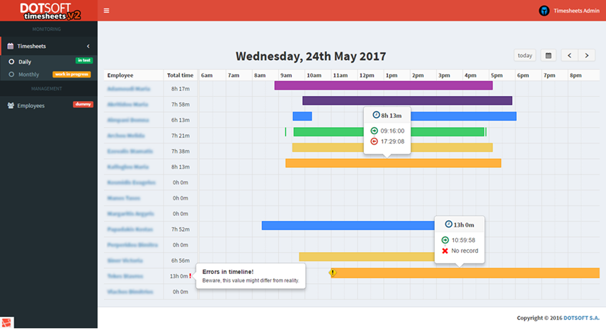

# DOTSOFT Timesheets v2

#### based on Paxton's Net2Access Control SDK & Laravel v5.3

[Timesheets v1 (legacy)](http://version.ds.dotsoft.gr:8080/timesheet/) | [Timesheets v2](http://timesheets.staging.dotsoft.gr)

---

### **Build Instructions**

**Prerequisites:** Docker Compose has to be installed on your machine. ([Install Docker Compose](https://docs.docker.com/compose/install/))

1. Clone the project inside a directory in which your user has full read/write access.
2. Edit .env configuration file to supply database details.
3. Execute the following command inside the main repository root:

    `docker-compose up -d`
